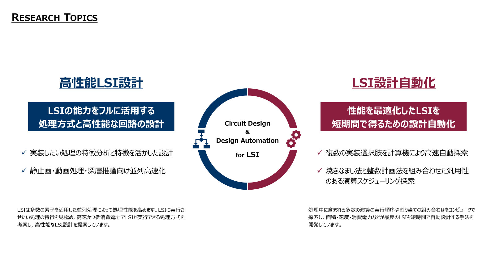

<!-- profile/README.md -->

# Ito Laboratory (Saitama University)

## Overview

高性能LSI設計とLSI設計自動化に関する研究を行っています。

LSI（大規模集積回路）は、半導体結晶片にナノスケールの回路素子（トランジスタ）を組合せたディジタル回路を作りこんだものであり、様々な情報通信機器や家電、自動車などに組み込まれて信号処理や画像処理、数値計算、制御、記憶を担っています。  
LSIは多数の素子を活用した並列処理によって処理性能を高めます。LSIに実行させたい処理の特徴を見極め、高速かつ低消費電力でLSIが実行できる処理方式を考案し、高性能なLSI設計を提案しています。また、処理中に含まれる多数の演算の実行順序や割り当ての組み合わせをコンピュータで探索し、面積、速度、消費電力などが最良のLSIを短時間で自動設計する手法を開発しています。

🔗 https://elc.eeap.saitama-u.ac.jp/
